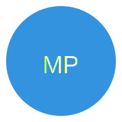

<!-- SLIDE -->

# Mi Presentación de Ejemplo

Bienvenidos a esta presentación de ejemplo que muestra las características del sistema.

<!-- NOTES -->
Esta es la primera diapositiva de la presentación.
Aquí podemos ver el título principal y una breve introducción.

<!-- SLIDE -->

## Características Principales

$COLUMNS$
$COL$
- Fácil de usar
- Basado en Markdown
- Soporte para notas
$COL$
- Temas personalizables
- Imágenes y multimedia
- Diseño responsive
$END$

<!-- NOTES -->
En esta diapositiva mostramos las características principales usando columnas.
Las columnas ayudan a organizar mejor la información.

<!-- SLIDE -->

## Ejemplo con Imagen

<!-- NOTES -->
Aquí mostramos cómo incluir una imagen en la presentación.
La imagen debe estar en el directorio images/ de la presentación.

<!-- SLIDE -->

## Ejemplo de Grid

$GRID$
$ROW$
$CELL$
Característica 1
$CELL$
Característica 2
$ROW$
$CELL$
Característica 3
$CELL$
Característica 4
$END$

<!-- NOTES -->
Este es un ejemplo de cómo usar el formato de grid para organizar el contenido.
Útil para mostrar información en una cuadrícula.

<!-- SLIDE -->

# ¡Gracias!

¿Preguntas?

<!-- NOTES -->
Esta es la última diapositiva.
Es un buen momento para preguntas y respuestas. 